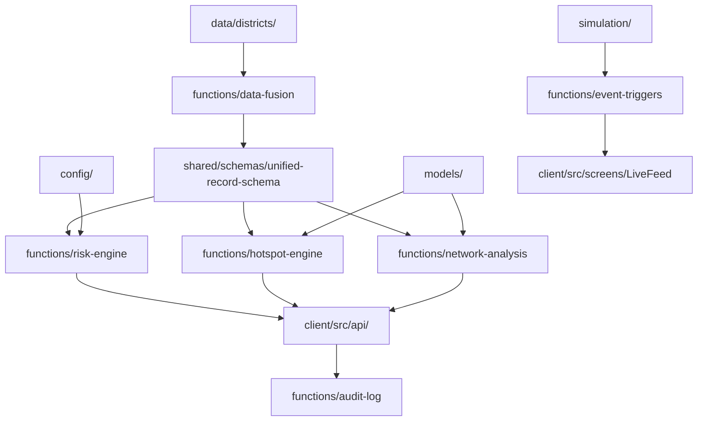

# PRAHARI System Architecture & Operational Guidelines

## 1. Overall Architecture & System Topology

PRAHARI is a statewide predictive policing and decision-support platform designed to ingest multi-source crime data, normalize disparate schemas, calculate dynamic risk metrics, identify spatial hotspots, analyze criminal syndicate networks, and push real-time incident updates to operational dashboard interfaces.

```
+-----------------------------------------------------------------------------------+
|                                  CLIENT LAYER (M3)                                |
|  ActionQueue | InvestigationWorkspace | HotspotMap | NetworkGraph | RiskDetail   |
|  AuditLog    | ReportExport           | AdminConsole | LiveFeed  | StateOverview  |
+-----------------------------------------------------------------------------------+
                                         |
                                 REST & Event Stream
                                         v
+-----------------------------------------------------------------------------------+
|                              PLATFORM & REAL-TIME (M4)                            |
|  Audit Log  |  Outcome Loop  |  Report Export  |  Event Triggers  |  Auth Hooks   |
+-----------------------------------------------------------------------------------+
             |                                                       ^
       Risk / Hotspot Calls                                  Realtime Feed Updates
             v                                                       |
+------------------------------------+             +--------------------------------+
|    DECISION ENGINE & ANALYTICS (M2)  |             |      SIMULATION ENGINE (M4/M1) |
| Risk Engine | Hotspot | Network     |             | Event Generator | Incident     |
| (Models & Algorithms)              |             | Patrol Stream   | Scheduler    |
+------------------------------------+             +--------------------------------+
                 ^                                                   |
                 | Normalized Data Payload                           |
                 +---------------------------+-----------------------+
                                             |
                                             v
+-----------------------------------------------------------------------------------+
|                                DATA & FUSION (M1)                                 |
|  Whitefield Adapter | HAL Adapter | Bellandur Adapter | Indiranagar Adapter       |
|                     Unified Record Schema (unified-record-schema.js)              |
+-----------------------------------------------------------------------------------+
```

## 2. Module Dependency Flow



## 3. Four-Member Folder Ownership Model

| Team Member | Domain Responsibility | Primary Directories & Subfolders |
| :--- | :--- | :--- |
| **Member 1 (M1)** | Data & Fusion Layer | `functions/data-fusion/`, `data/`, `data/districts/`, `shared/schemas/` |
| **Member 2 (M2)** | Decision Engine & Analytics | `functions/risk-engine/`, `functions/hotspot-engine/`, `functions/network-analysis/`, `models/`, `analytics/` |
| **Member 3 (M3)** | Frontend UI & User Experience | `client/`, `assets/maps/geojson/`, UI state & screens |
| **Member 4 (M4)** | Platform Infrastructure & Real-Time | `functions/audit-log/`, `functions/outcome-loop/`, `functions/report-export/`, `functions/event-triggers/`, `functions/auth-hooks/`, `simulation/`, `deployment/`, `config/` |

## 4. Development Workflow & Git Branch Strategy

### Branching Model
- `main`: Production-ready release branch.
- `development`: Active integration branch.
- `feature/m1-<feature-name>`: Data & Fusion feature branches.
- `feature/m2-<feature-name>`: Decision Engine feature branches.
- `feature/m3-<feature-name>`: UI Screen feature branches.
- `feature/m4-<feature-name>`: Platform & Simulation feature branches.

### Pull Request & Review Process
1. Developers branch off `development`.
2. All feature changes must pass unit and schema validation tests (`npm test`).
3. PRs require sign-off from the domain owner before merging into `development`.

## 5. Coding & Naming Conventions

### File Naming
- **Functions & Adapters**: Kebab-case (e.g., `whitefield-adapter.js`, `unified-record-schema.js`).
- **React Components & Domain Utilities**: PascalCase (e.g., `InvestigationWorkspace.jsx`, `Crime.js`, `Risk.js`).
- **Config & JSON Files**: Kebab-case (e.g., `risk-thresholds.json`, `crime-types.json`).

### Code Style
- **JavaScript**: ES6+ syntax, async/await for asynchronous I/O, explicit parameter validation.
- **Variables & Functions**: camelCase (e.g., `calculateRiskScore`, `unifiedRecord`).

## 6. API Naming Conventions

All REST endpoints exposed by serverless functions follow plural nouns and standard HTTP verbs:

- `GET /api/v1/fusion/records` - Fetch fused crime records
- `POST /api/v1/risk/evaluate` - Calculate risk score for a suspect profile
- `GET /api/v1/hotspots` - Fetch spatial hotspot clusters
- `GET /api/v1/network/graph` - Query syndicate graph nodes and edges
- `POST /api/v1/audit/logs` - Append an audit log entry
- `POST /api/v1/simulation/control` - Start/pause/adjust simulation speed

## 7. Error Handling Guidelines

All functions must return structured JSON error payloads with standard HTTP status codes:

```json
{
  "error": {
    "code": "INVALID_STATION_SCHEMA",
    "message": "The provided record from station HAL is missing mandatory ISO timestamp.",
    "timestamp": "2026-07-22T20:14:00Z",
    "details": []
  }
}
```

- **400 Bad Request**: Invalid input payload or failing schema validation.
- **401/403 Unauthorized/Forbidden**: Failed auth hook or insufficient role.
- **404 Not Found**: Specified record, district, or station code not found.
- **500 Internal Server Error**: Unhandled exception caught by global function wrapper.

## 8. Logging Guidelines

- **Log Format**: JSON formatted logs for central ingestion.
- **Log Levels**:
  - `DEBUG`: Internal execution steps, adapter transformation details.
  - `INFO`: Standard lifecycle events (e.g., event stream ticks, API requests).
  - `WARN`: Schema fallback usages, date parsing adjustments.
  - `ERROR`: Pipeline failures, unhandled promise rejections, database connectivity issues.
